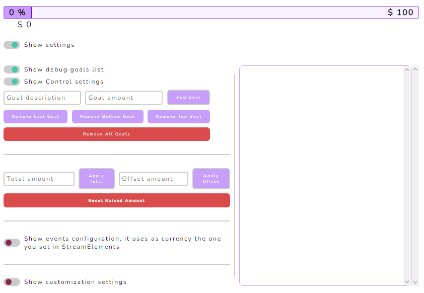
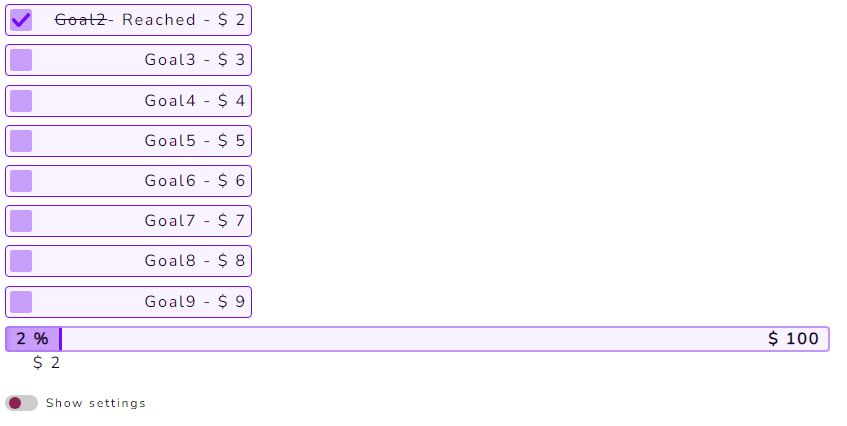
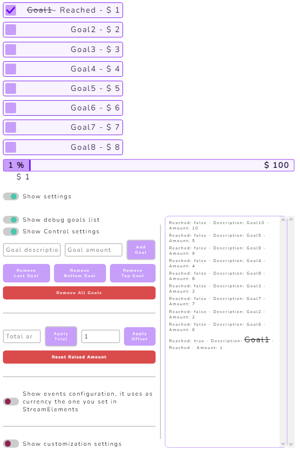
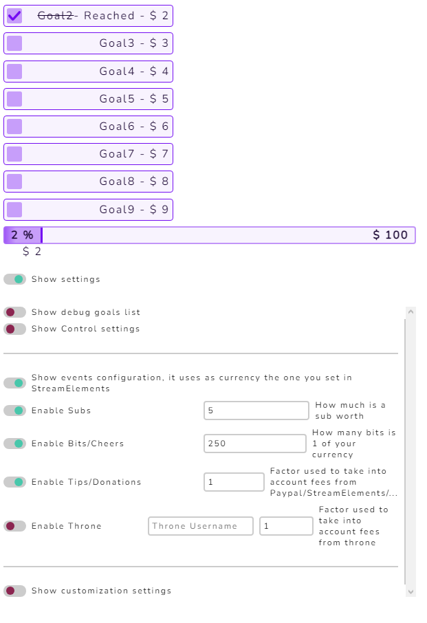
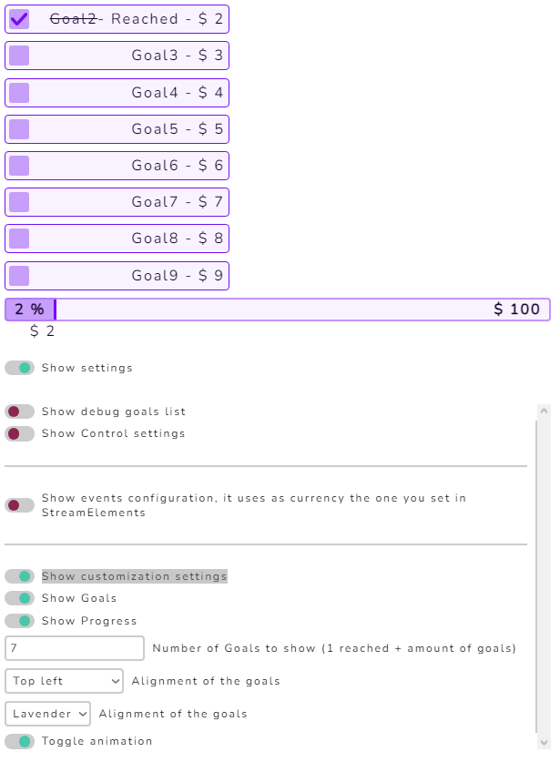
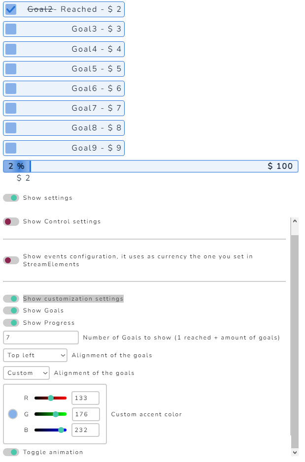

# DonoGoal-Tracker
Create an interactive, customizable StreamElements DonoGoalTracker for live streams. Track subs, bits, tips, and THRONE with ease. Engage and entertain your viewers.

## Features
- Real-time donation goal tracking
- Retention of the goals and events even if the widget is closed
- Customizable goal amount and description
- Customizable overlay goal
- Real-time tracking of donations, bits, subs
- Almost real-time tracking of the Throne wishlists of your choice
- All tracked events can be adjusted with a ratio to take into account any fees
- Automatic detection of your currency, so it displays it accordingly (keep in mind that the Throne wishlist is in USD)
- Show or hide the individual goals or the overlay progress
- Customizable amount of goals to show, it will show the highest reached goal first then the amount you want of not reached goals
- Choose to display where you want the goals to be displayed (top, bottom, left, right) relative to the progress bar
- Dynamic themes
- 3 presets to choose from (Gold, Peach, Lavender) OR custom
- If you choose custom, you can choose the accent color and the widget will adapt accordingly
- And more ...

## Installation
1. Download the HTML, CSS, and JavaScript files.
2. Upload them to your StreamElements overlay.
3. Add a new browser source overlay in your streaming software (like OBS) and use the HTML file URL.

## Usage
### Configuration
Once you've added the widget into your streaming software of your choice, you can configure it by interacting with the page content (in obs, select the browser source and click on "interact" at the bottom right of the preview window).

for the followings examples, I've added 10 bogus goals (in no particular order) and set an offset of 2 to display the capabilities of the widget.

The `Show settings` switch will show or hide the settings menu.

As you can see on the settings menu on the right, you can see a list of all the goals you've set, in the order you have added them. You can see which one are reached by them being barred. This list can be hidden with the `Show debug goal list` switch.

Once you are done setting up your goals, I suggest you to hide the control settings with the `Show Control settings` switch and hide the debug goals list.

Now by switching `Show events configuration, it uses as currency the one you set in StreamElements` you can configure which events you want to track and how much they are worth in your currency. You can also set the ratio of the Throne wishlist to your currency.

 

However you need to input your Throne username (the same present in your throne url) in the `Throne username` field.

**IMPORTANT** : The Throne wishlist is updated every 15 minutes, so it may take a while for the widget to update the amount raised. This is due to limitations, as Throne doesn't have an API I have made one for the use but it's limited to 1 000 000 request per month, (which with a rate at 15 minutes gives ~336 users concurrently using the widget). If you abuse of it I will have to take it down.
The way i get the data might also be disabled at some point by Throne, so if it stops working, please let me know.

Now that you have set up your goals and events, you can customize the widget to your liking. Same as before I recommend you to hide the events settings.

To show or hide the customization settings, use the `Show customization settings` switch.

You can choose to show or hide the individual goals with the `Show Goals` switch.
The same way with `Show Progress` you can choose to show or hide the progress bar.

By changing the Number of goals to show, you can choose how many goals you want to show. The widget will show the highest reached goal first then the amount you want of not reached goals (Cheapest not reached yet).

You have 6 different positions to choose for the goals in relation to the progress bar, you can choose to display them on the top or bottom, and left, center or right. 

To select a theme you have 4 options, 3 presets (Gold, Peach, Lavender) and Custom. If you choose custom, a color selector will appear then you can choose the accent color and the widget will adapt accordingly.

Lastly the `Toggle animation` switch will toggle the animation of the progress bar.

**CONGRATULATIONS** you are done setting up your widget, you can now hide the settings menu and enjoy your stream.

### Support
If you have any questions, suggestions, or issues, feel free to rise an issue on [GitHub](https://github.com/LordLumineer/CustomStreamElementsWidget/issues) contact me on [Twitter](https://twitter.com/lordlumineer)

### Credits

A BIG thank to the [ojcole](https://github.com/ojcole) for the Throne handling code, I couldn't have done it without him.

- **Small note:** I do this on my free time, and am NOT a professional programmer, so it may not be the best code you've ever seen, but it *works*. Feel free to share any issues you may encounter, I'll try to fix them as soon as I can.

### License

Copyright (c) 2023 Lord Lumineer (github -- LordLumineer).

Permission is hereby granted, free of charge, to any person obtaining a copy of this software and associated documentation files (the "Software"), to deal in the Software without restriction, including without limitation the rights to use, copy, modify, merge, publish, distribute, sublicense, and/or sell copies of the Software, and to permit persons to whom the Software is furnished to do so, subject to the following conditions:

The above copyright notice and this permission notice shall be included in all copies or substantial portions of the Software.

THE SOFTWARE IS PROVIDED "AS IS", WITHOUT WARRANTY OF ANY KIND, EXPRESS OR IMPLIED, INCLUDING BUT NOT LIMITED TO THE WARRANTIES OF MERCHANTABILITY, FITNESS FOR A PARTICULAR PURPOSE AND NONINFRINGEMENT. IN NO EVENT SHALL THE AUTHORS OR COPYRIGHT HOLDERS BE LIABLE FOR ANY CLAIM, DAMAGES OR OTHER LIABILITY, WHETHER IN AN ACTION OF CONTRACT, TORT OR OTHERWISE, ARISING FROM, OUT OF OR IN CONNECTION WITH THE SOFTWARE OR THE USE OR OTHER DEALINGS IN THE SOFTWARE.